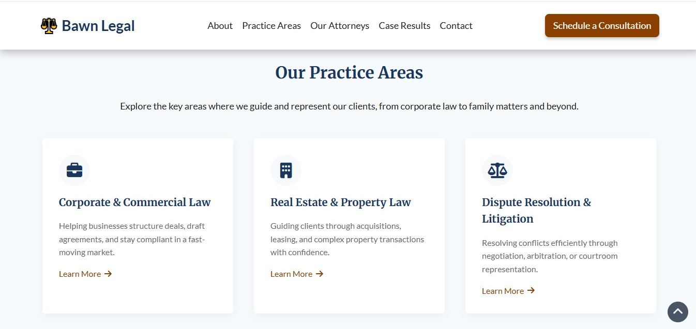

# Bawn Legal - Law Firm Website

A fully responsive, multi-page website concept for a fictional law firm. Built with HTML, CSS, and JavaScript, it features practice areas, attorney bios, case results, a blog-style insights section, and an accessible contact form, all structured to reflect real-world legal website standards.

## 🌐 Live Demo:

[View the live site](https://bawnlegal.vercel.app)

## 📸 Screenshots:

### Bawn Legal website hero

### Bawn Legal website practice areas section

## ✅ Features:

- Multi-page layout: Home, About, Practice Areas, Legal Insights, Contact
- Practice Areas displayed as responsive service cards
- Case Results to showcase legal outcomes and build trust
- “Legal Insights” blog-style section for updates and advice
- Team profiles for introducing attorneys/lawyers
- FAQ accordion for common client questions
- Client Testimonials for social proof
- Contact form with accessible fields and clear call-to-action
- Fully responsive design across desktop, tablet, and mobile

## 📁 Pages Included:

- `index.html` — Homepage
- `about.html` — About the Firm
- `team.html` — Attorney Profiles
- `practice-areas.html` — Services Offered
- `case-results.html` — Client Outcomes
- `contact.html` — Contact Form
- `privacy-policy.html` — Legal Disclaimer
- `terms-of-service.html` — Terms & Conditions

## 🛠 Technologies Used:

**HTML5** - Semantic structure

**CSS3** - Custom styling with flexbox and grid, responsive design

**JavaScript** - Interactivity, dynamic content

## 👤 Author:

- Portfolio: [chijioke-nwabasili.vercel.app](https://chijioke-nwabasili.vercel.app)
- LinkedIn: [Chijioke Nwabasili](https://linkedin.com/in/chijioke-nwabasili)

## 📌 Note:

This is a fictional project created for portfolio purposes. All content and case examples are mock data and not based on real legal cases or clients.

